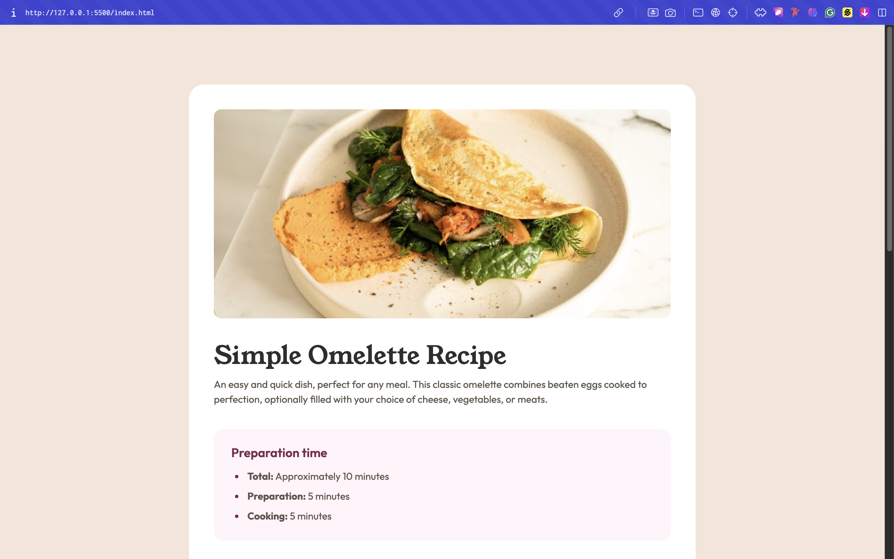

# Frontend Mentor - Recipe page solution

This is a solution to the [Recipe page challenge on Frontend Mentor](https://www.frontendmentor.io/challenges/recipe-page-KiTsR8QQKm). Frontend Mentor challenges help you improve your coding skills by building realistic projects. 

## Table of contents

- [Overview](#overview)
  - [The challenge](#the-challenge)
  - [Screenshot](#screenshot)
  - [Links](#links)
- [My process](#my-process)
  - [Built with](#built-with)
  - [What I learned](#what-i-learned)
  - [Continued development](#continued-development)
- [Author](#author)

## Overview

### Screenshot

### Links

- Solution URL: (https://www.frontendmentor.io/solutions/recipe-page-main-yB6z4Tf8e8)
- Live Site URL: (https://recipe-page-main-ivory-xi.vercel.app/)

## My process

### Built with

- HTML
- CSS

### What I learned

Today, I applied what i have learn in the past on how to make web layouts fully responsive by converting pixels to vw and also learnt to use flexbox and box-sizing for full-width divs, and targeting specific elements with pseudo-classes like :last-child. I also learned to style list markers and apply popular breakpoints so designs look good on all devices. Overall, I now know how to make content adapt seamlessly across different screen sizes.

### Continued development

Focus on advanced flex/grid layouts, fluid typography and spacing, and responsive design patterns to make your pages scale beautifully on all devices.

## Author

- Website - [Timothy Ezeigbo]
- Frontend Mentor - [@teeofkings](https://www.frontendmentor.io/profile/teeofkings)
- Twitter - [@teeofkings](https://www.twitter.com/teeofkings)
